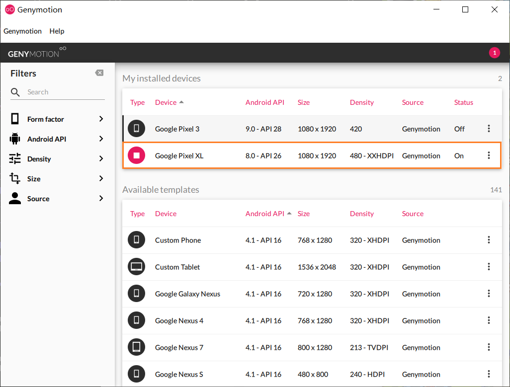

# Jaiguomeng Assistor

> 使用 Python 和 Adb 工具编写的《家国梦》辅助脚本，能够自动收集金币、升级建筑、点击红包和相册。本脚本中自带的配置文件仅用于分辨率为 1080P 的设备。

## 运行

1. 配置 Adb 环境；
2. 若你的设备分辨率不是 1080P（1080x1920），请自行建立相应的配置文件，并更改`main.py`中的`from config_xxxxx import *`语句，你也可以选择使用安卓模拟器（推荐 Genymotion）直接设定这个分辨率；
3. 连接手机或者打开模拟器，`python main.py`运行主程序。

> 本脚本具有一定的防检测功能。

## 示例

使用了 Genymotion 安卓模拟器，屏幕参数见下图。游戏版本 V1.2.3。

演示视频：https://yusanshi.com/jgm.mp4

> 截屏和视频中没有货物是因为我已经把每日的货物给消耗完了（瘫倒~